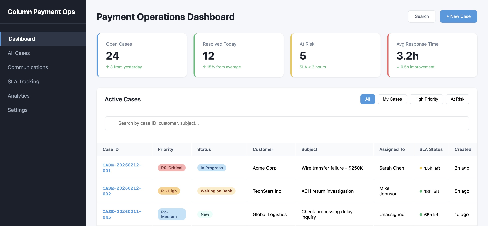

```{r}
#| label: setup
#| include: false

library(DBI)
library(RSQLite)

con <- dbConnect(RSQLite::SQLite(), "payment_ops_db")
```

# PROBLEM ONE

## Subject Line: Wire Return Investigation - wire_2QIZQwWo3bXp4aP5NUKFDJAXw4k

Good afternoon,

We are sorry to hear that a return was triggered on your customer's outgoing wire and apologize for any inconvenience this might have caused. Upon investigation the return was triggered by an **INVALID ACCOUNT NUMBER**.

**ORIGINAL OUTGOING WIRE**

-   Wire Transfer ID: wire_2QIP3WQNoEe583ciCS98XFBVqid
-   Sent at: 2023-05-25 18:05:26 UTC
-   Amount: \$183,639

**RETURNED WIRE**

-   Wire Transfer ID: wire_2QIZQwWo3bXp4aP5NUKFDJAXw4k
-   Returned at: 2023-05-25 19:30:44 UTC
-   Amount: \$183,639
-   Reason: INVALID ACCT ORG REF 202305250003

Let us know if you have any questions or if we can assist you with anything else.

Sincerely,\
Column Team

## **Queries & Approach**

-   STEP 1: search matching requested wire

-   STEP 2: match amount and date from step 1, ensuring is_incoming = 0 (returned)

::: panel-tabset
## Wire Return Search

```{sql}
#| connection: con
#| label: wire-return-search

SELECT 
    wire_transfer_id,          
    amount,
    datetime(completed_at) as timestamp,                
    bank_to_bank_message,
    is_incoming	
FROM wire_transfers 
WHERE wire_transfer_id = 'wire_2QIZQwWo3bXp4aP5NUKFDJAXw4k';
```

## Wire Return Match 

```{sql}
#| connection: con
#| label: wire-return-match
SELECT 
    wire_transfer_id,           
	amount,                  
    datetime(completed_at) as timestamp,             
    is_incoming               
FROM wire_transfers 
WHERE amount = '183639'       
  AND is_incoming = '0'      
  AND date(completed_at) = '2023-05-25'; 
```
:::

# PROBLEM 2

## Contacting Financial Inst.

1.  Look up receiving bank using routing number (061120084) using [American Bankers Association (ABA)](routingnumber.aba.com).

2.  Contact ACH Operations Department by finding official contact info (email/phone number) from their website's ACH contact page

3.  If no public contact information, call general number and ask to be transferred to ACH department

## Email to Financial Inst.

### **Subject Line:** ACH Return Investigation - Trace \# 121145340551340 

Good afternoon ACH Department, 

I am reaching out from Column regarding an ACH transaction that was returned by your institution with a return code R23 (Credit Entry Refused by Receiver).

**TRANSACTION DETAILS:**

-   Original Trace Number: 121145340551340

-   Return Trace Number: 061120080831693

-   Effective Date: May 1, 2023

-   Amount: \$500.00

-   Originator (our record): Dorothe Bauer-Holsten

-   Receiver: Prof. Reza Trüb

We believe the discrepancy between what the customer saw the originating company name as "Soccer Club LLC" and "Dorothe Bauer-Holsten" (our record) to be the cause for the return.

To help us solve this, we would appreciate if you:

1.  Review your records and confirm the company name displayed (originator) for this transaction
2.  Confirm if there was any other additional company information that contained "Soccer Club LLC"

This information will help us work with the customer to ensure their information is formatted correctly to prevent this issue from arising again.

Thank you for your assistance.

Best, \
Column Team

## Email to Customer

### Subject Line: ACH Return Investigation - Transaction acht_2PBthBuXNLs5aeK0ceeCEJGY4SP

Hello \[Customer Name\],

We are writing in regards to the ACH transfer with ID **acht_2PBthBuXNLs5aeK0ceeCEJGY4SP**.

Upon investigation we found that the transfer was returned by the receiving bank with return code **R23 (Credit Entry Refused by Receiver)** on 05/03/2023. This means the receiving account holder or their bank declined the incoming transfer.

**TRANSACTION DETAILS:**

-   Amount: \$500.00

-   Effective Date: May 1, 2023

-   Originator Name (our records): Dorothe Bauer-Holsten

-   Receiver: Prof. Reza Trüb

-   Receiving Bank Routing: 061120084

-   Trace Number: 121145340551340

You mentioned the receiving bank showed "Soccer Club LLC" as the originator instead of "Dorothe Bauer-Holsten." We're investigating this with the receiving bank to understand exactly what information they had on file.

**Possible Causes:**

1.  If you're processing payments on behalf of "Soccer Club LLC," that information may have been included in the addenda or company entry description fields, which some banks display to their customers instead of the primary company name field.

2.  There may have been a data mapping issue in how the originator information was submitted to us when initiating this transfer.

We are in contact with the receiving bank to understand their records of what the originator information was. In the meantime can you confirm:

1.  Are you processing this payment on behalf of "Soccer Club LLC" or another third party?
2.  What originator information did you intend to be displayed to the receiver?
3.  Do you have any relationship with "Soccer Club LLC"?

Once we hear back from the receiving bank, we'll provide you with a full root cause analysis and recommendations for preventing this issue in future transactions.

The funds from this returned transaction have been credited back to your account.

Please let us know if you have any questions or additional information that might help with our investigation.

Best regards,\
Column Team

## Queries & Ideas

**ISSUE**

-   Receiving bank shows ORIGINATOR COMPANY: Soccer Club LLC 

-   Column shows ORIGINATOR COMPANY: Dorthe Bauer-Holsten

-   ACH RETURN CODE: R23, Credit Entry Refused by Receiver (trace #: 061120080831693)

**ROOT CAUSE**

-   Discrepancy in company name triggered receiver (or bank) to reject transaction

-   Possible Reasons

    -   Customer incorrectly entered information, putting "Soccer Club LLC" in fields

    -   Didn't recognize "Soccer Club LLC" as legitimate sender

    -   ACH had "Soccer Club LLC" under company description, but it overrode company name

::: panel-tabset
## Transfer Return Search

```{sql}
#| connection: con
#| label: transfer-return-search

SELECT 
    ach_transfer_id,
    datetime(effective_on) as timestamp,
    amount,
    status,
    company_name,
    receiver_name,
    company_id,
    routing_number,
    trace_number
FROM ach_transfers
WHERE ach_transfer_id = 'acht_2PBthBuXNLs5aeK0ceeCEJGY4SP';
```

## Transfer Return Match 

```{sql}
#| connection: con
#| label: transfer-return-match
SELECT 
    ach_return_event_id,
    ach_transfer_id,
    return_code,
    description,
    datetime(created_at) as timestamp,
    status
FROM ach_returns
WHERE ach_transfer_id = 'acht_2PBthBuXNLs5aeK0ceeCEJGY4SP'; 
```

# 
:::

# PROBLEM 3

## Queries & Approach

::: panel-tabset
## Transfer Trace Search

```{sql}
#| connection: con
#| label: transfer-trace-search

SELECT 
    ach_transfer_id,
    effective_on,
    amount,
    status,
    is_incoming,
    company_name AS column_customer,
    receiver_name AS end_recipient,
    company_id,
    trace_number
FROM ach_transfers
WHERE trace_number = '091000018873580'
AND amount = 289527.45;
```

## Transfer Alternative Search 

```{sql}
#| connection: con
#| label: transfer-alt-search
SELECT 
    ach_transfer_id,
    effective_on,
    amount,
    status,
    is_incoming,
    company_name AS column_customer,
    receiver_name AS end_recipient,
    company_id,
    trace_number
FROM ach_transfers
WHERE trace_number = '091000018873580';
```

## Related Customer Search

```{sql}
#| connection: con
#| label: related-customer-search

SELECT 
    ach_transfer_id,
    effective_on,
    amount,
    status,
    receiver_name,
    trace_number
FROM ach_transfers
WHERE company_name = 'Herr Philipp Krebs'
ORDER BY effective_on DESC
LIMIT 20;
```

## Related Recipient Search 

```{sql}
#| connection: con
#| label: related-recipient-search

SELECT 
    ach_transfer_id,
    effective_on,
    amount,
    status,
    company_name AS column_customer,
    trace_number
FROM ach_transfers
WHERE receiver_name = 'Pavel Schulz-Staude'
ORDER BY effective_on DESC;
```
:::

## Results 

INCOMING ACH TRANSFER (to Column):

-   ACH Transfer ID: `acht_2PJ01uHSLNCOe2bZvud67EjHOty`

-   Trace Number: 091000018873580

-   Amount: **\$289,527.45**

-   Effective Date: May 4, 2023

-   Status: Settled

-   Transfer Type: **Incoming** (received by Column customer)

-   Originating Bank: Wells Fargo

-   Column Customer (Receiver): Herr Philipp Krebs

-   End Recipient: Pavel Schulz-Staude

## Email to Customer

### Subject Line: URGENT. FRAUD INVESTIGATION. ACH Transfer acht_2PJ01uHSLNCOe2bZvud67EjHOtyP

Hello Herr Philipp Krebs,

We are reaching out regarding an URGENT FRAUD INVESTIGATION related to incoming ACH transfer that your account received on 05/04/2023.

-   ACH Transfer ID: acht_2PJ01uHSLNCOe2bZvud67EjHOty

-   Trace Number: 091000018873580

-   Amount: **\$289,527.45**

-   Effective Date: May 4, 2023

-   Originating Bank: Wells Fargo

Wells Fargo reached out and reported that their customer was a victim of a [Business Email Compromise (BEC)](https://www.fbi.gov/how-we-can-help-you/scams-and-safety/common-frauds-and-scams/business-email-compromise) scam. They are alleging that this **\$289,527.45** transfer was unauthorized and fraudulent, and are requesting an IMMEDIATE return of these funds.

To determine the legitimacy of this transaction, we are launching an investigation and need the following evidence/information immediately:

1.  Payment authorization and verification:
    -   Receipt and reason of payment

    -   How transaction was originally arranged (email, phone, etc)
2.  Sender information:
    -    Relationship to Wells Fargo customer

    -   How long you been doing business with this party
3.  Recipient information:
    -   Pavel Schulz-Staude's relationship to your business

    -   Past payments to Pavel Schulz-Staude
4.  Due diligence:
    -   Did you verify the sender's identity and payment authorization?

    -   Did you notice anything unusual about the payment request/communication?

If you cannot provide satisfactory documentation that this was a legitimate transaction, we may be required to return the funds to Wells Fargo and suspend your account pending further investigation.

Please reply to this email with the requested information as soon as possible. You may also call us \[### \### ####\] to discuss this immediately.

Best regards, \
Column Team

# PROBLEM 4

## Approach

Use Google Workspace tools (Sheets, Gmail, Apps Script) to create centralized case management system. Standardizes cases with unique IDs, automates Gmail and Slack case related information, scraping relevant information, SLA monitoring, and maintains clear communication through all channels. Ensures nothing is missed without third-party software purchases.

-   Set up Google Sheets by editing App Script to log:

    1.  automated email processing (every 5 mins)
    2.  SLA monitoring & breach detection (hourly)
    3.  communication
    4.  Slack notifications

-   Configure Slack to process cases directly

    1.  Check case details
    2.  View assigned cases
    3.  Update status/notes

-   Integrate Gmail to forward payment-ops related emails to spreadsheet

## Key Features

1.  Case Tracking
    -   Unique case ID (MMDDYYYY-XXX)

    -   Gmail and Slack linked
2.  Communication: all emails/Slack messages logged and easily searchable
3.  SLA Monitoring
    -   Automated breach alerts, at-risk flags

    -   Hourly SLA checks
4.  Analytics
    -   Dashboard with cases by status, type, priority

    -   SLA compliance metric

## Dashboard 



# LLM PROMPTS 

General:

1.  What program to use to explore databases?
2.  General instructions on applying SQL to RStudio and Quarto presentations

Question One:

1.  

Question Two:

1.  

Question Three:

1.  What steps are taken when BEC scam is being investigated?
2.  What information is required (originator/receiver) when BEC scam is being investigated?

```{r}
#| include: false

dbDisconnect(con)
```
